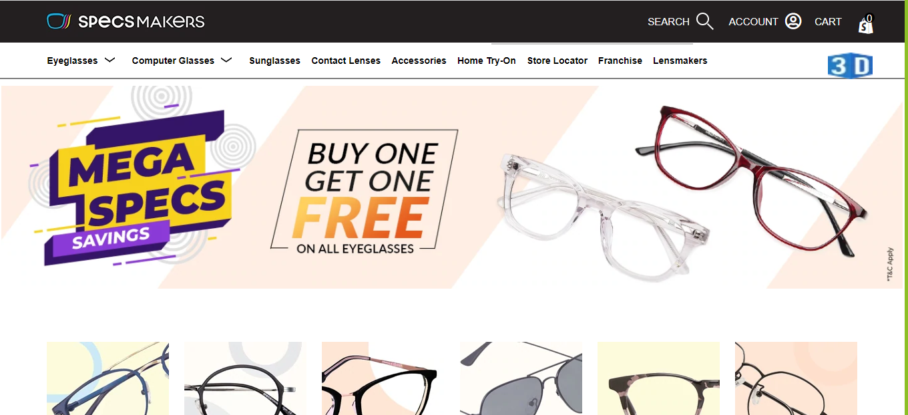
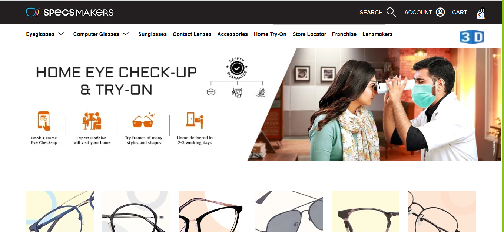
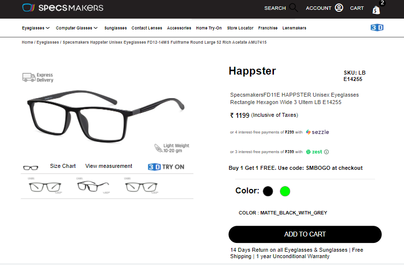

Specs-Makers-clone-deployed-link-
https://tender-hoover-a53af4.netlify.app/

# Specs-Makers-clone
We are thankful to Masai school, given a chance to prove by ourself’s. We are so happy to share our journey in this construct week project. Our project is regarding cloning a website, first let me introduce my team members and group name is AnoxCoo.

group members are:  
- Durga Bhavani V  
- Navneet kumar  
- Pooja Yadav  
- Sudeep Gudekota  
- Nakul Deshmukh  
- Kimmi kumari Sinha
 

This is the home page of specsmakers.in clone.

## Tech Stack Used 
1.HTML,  
2.CSS, 
3.JAVA SCRIPT, 
4.NodeJs, 
5.Api's  

This is the home page of specsmakers.in clone.

## OUR CHALLENGES :
We faced a lots of challenges while completing this project, The major problem was that we were working remotely so, communication and time management was major issue between us. As the project had short span of deadline so, on the last two days we all were working the whole night to complete our user-friendly website.
- Making Responsive Website and adding java script features
- Sliding images, adding hem-burger functionality to navbar
- Creating own data which required for website
- while merging code and commit data to repository

We all are SOLVED our challenges as a team with good team spirit and finally cloned the website.

This is the Cart page of specsmakers.in clone.

## Key Learnings

- Problem Solving: As we faced many challenges during this project but we never gave up and try to solve every problem accordingly.  
- Creativity: We apply creative thinking skills to innovate new product designs and possibilities for projects and how to manage projects and assignments more efficiently.  
- Leadership: We take ownership over their projects, reflecting on and celebrating their progress and accomplishments.

## Ending Note 
At last, I want to thank the whole Masai School team.

## In the future, We would love to do these types of projects more.

